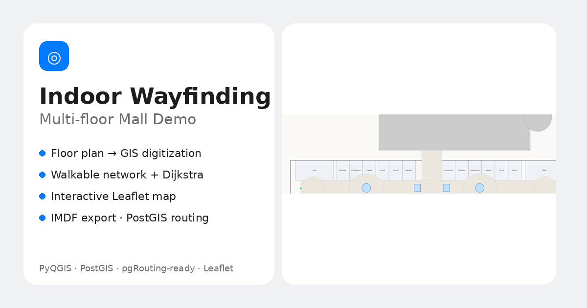
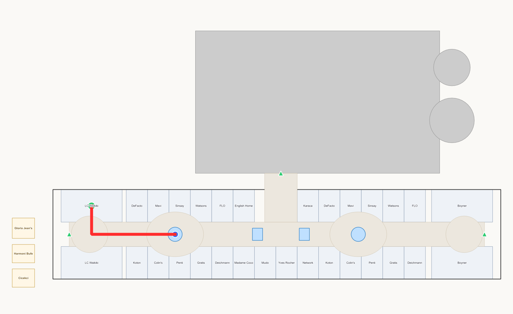
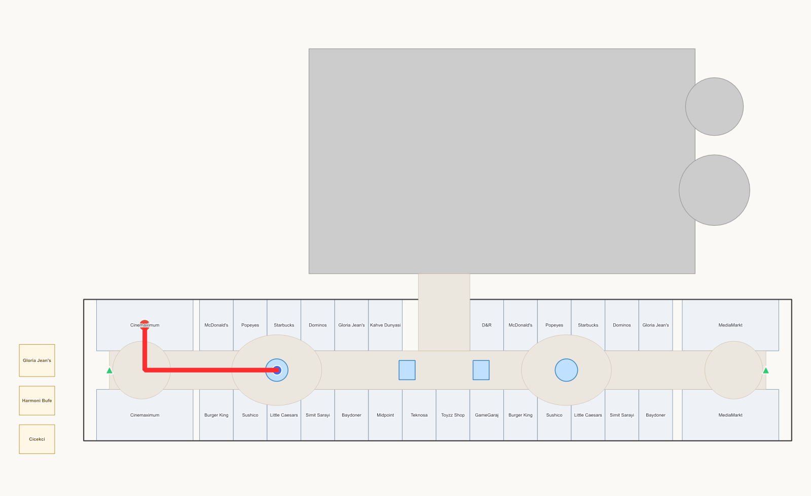
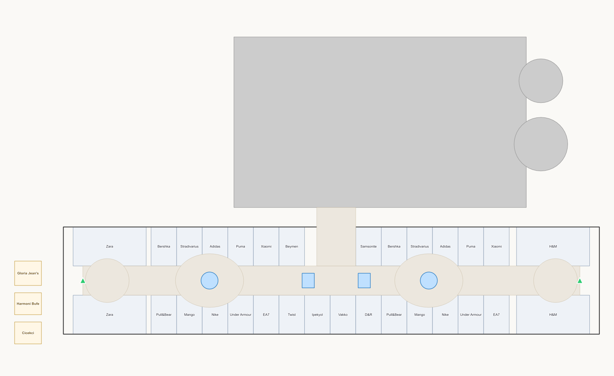

# 🧭 Indoor Wayfinding — Multi-floor Mall Demo

An end-to-end **indoor mapping & wayfinding** demo for a shopping mall: a floor plan is
digitized into GIS layers, turned into a walkable network, and routed with **Dijkstra** —
across floors via escalators, elevators and stairs. Interactive **Leaflet** map, exported to
**IMDF**, and cross-checked in **PostGIS / pgRouting**.

**🔗 Live demo:** https://YOUR-USERNAME.github.io/mall-wayfinding-demo/
*(GitHub Pages linkinizle değiştirin)*



---

## ✨ What it does

- **Store-to-store routing** — pick two shops (e.g. *LC Waikiki → Cinemaximum*) and get the
  shortest indoor path, across 3 floors.
- **Multi-floor transitions** — escalators, elevators and stairs connect the levels.
- **Commercial vs. accessible modes** — *Normal* prefers escalators (walking shoppers past
  more stores); *Accessible* disables stairs/escalators and routes via the elevator.
- **Turn-by-turn directions** — walking time, distance, and the stores you pass on the way.
- **Store search, floor switcher, category filters** (fashion / food), responsive on mobile.

## 🗺️ Screenshots

| Ground floor (start) | Top floor (destination) |
|---|---|
|  |  |

Route `LC Waikiki` (L0) → escalator → `Cinemaximum` (L2), ≈ 180 m.



## 🛠️ How it works (pipeline)

```
Floor plan  →  GIS layers (PyQGIS → GeoPackage)
            →  walkable network: nodes + edges, metric cost
            →  Dijkstra shortest path (pure Python / JavaScript)
            →  interactive web map (Leaflet)
            →  IMDF export  +  PostGIS / pgRouting (SQL)
```

- **CRS:** geometry authored in a metric CRS (UTM 35N) so routing costs are true metres,
  then reprojected to WGS84 for the web and IMDF.
- **Cost model:** vertical transitions are time-based (metre-equivalent). The elevator carries
  a *waiting-time penalty*, so normal routes prefer escalators — the deliberate commercial
  behaviour of malls. Accessible mode removes that penalty and forbids stairs/escalators.
- **Verified three ways:** Python, JavaScript and PostgreSQL (in-database Dijkstra) return the
  identical route and cost (180 / 219 / 122.7).

## 🧰 Tech

`PyQGIS` · `GeoPackage` · `PostGIS` · `pgRouting-ready` · `Dijkstra` · `Leaflet` · `IMDF` ·
`GeoJSON` · vanilla JS (no build step — data bundled in `data/bundle.js`).

## 📁 In this repo

```
index.html         # the interactive app (self-contained, no server needed)
data/              # GeoJSON layers + network.json + bundle.js
og-cover.png       # social preview
img/               # screenshots
```

## ⚠️ Disclaimer

Independent **educational / portfolio** project. The layout is a transformative
reconstruction **inspired by** a publicly visible mall floor plan — it is **not official**
and not affiliated with any mall or brand; store names are indicative.

---

*TR: Çok katlı bir AVM için uçtan uca iç mekân haritalama ve yol bulma demosu — kat planını
GIS'e sayısallaştırma, yürünebilir ağ, Dijkstra ile çok katlı rota, Leaflet harita, IMDF ve
PostGIS/pgRouting. Eğitim/portfolyo amaçlı bağımsız çalışmadır.*
